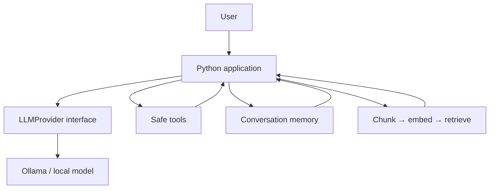

# Open AI Systems Lab

A small, local-first laboratory for learning how modern AI systems work by building them from understandable Python programs.

> **Understand → Implement → Run → Experiment → Connect**

This is not a framework and it does not promise AGI. It is a guided path from a weighted function and next-token prediction to a small local agent with tools, memory, and retrieval.

## Five-minute first success

```bash
python -m venv .venv
# macOS/Linux: source .venv/bin/activate
# Windows PowerShell: .venv\Scripts\Activate.ps1
python -m pip install -e .
python examples/local_chatbot/chat.py --demo
```

The demo works without Ollama and makes the provider boundary visible. For a real local answer, install [Ollama](https://ollama.com/), start it, and pull a small model:

```bash
ollama pull gemma3:1b
python examples/local_chatbot/chat.py --model gemma3:1b
```

The model name is configurable; use any model installed on your machine.

## What you will learn

| Level | Focus | Start here |
|---|---|---|
| 0 | Python for AI systems | `01_python_ai_foundations/` |
| 1 | weights, neurons, inference | `01_python_ai_foundations/` |
| 2 | tokens, embeddings, attention, sampling | `02_tokens/`–`05_transformers/` |
| 3 | local models, Ollama, model files | `06_local_llm/` and `docs/local-models.md` |
| 4 | prompting and structured output | `07_llm_application/` |
| 5 | tools and the agent loop | `08_tools/`, `09_agents/` |
| 6 | memory and RAG | `10_memory/`, `11_rag/` |
| 7 | evaluation and capstone | `12_evaluation/`, `examples/simple_agent/` |

Recommended order: **01 → 02 → 03 → 04 → 05 → 06 → 07 → 08 → 09 → 10 → 11 → 12**.

## Install

Python 3.10+ is recommended. The core lessons use only the standard library. Optional development dependencies are installed with:

```bash
python -m pip install -e '.[dev]'       # macOS/Linux
python -m pip install -e ".[dev]"       # PowerShell
```

No cloud API key is required. Copy `.env.example` only if you later add provider configuration.

## Architecture



The numbered lessons reuse the small `lab` package. Toy code is deliberately transparent; it is not a replacement for optimized Transformer runtimes.

## Run experiments

```bash
python 01_python_ai_foundations/linear_model.py
python 02_tokens/token_explorer.py "The cat sat on the mat"
python 03_embeddings/embedding_demo.py
python 05_transformers/attention_demo.py
python 07_llm_application/structured_output.py
python 08_tools/tool_calling.py
python 09_agents/agent.py --demo
python 11_rag/rag.py --question "What does this lab teach?"
python -m pytest
```

Each lesson README answers what, why, how, what to run, and what to change. Try temperature `0.2` versus `1.2`, alter the attention query, add a document, or change a tool description.

## What not to miss

**Tokens** are the model's units; **embeddings** are learned vectors; **logits** are unnormalized scores; **softmax** turns scores into probabilities; **attention** mixes information from context; **inference** is running fixed weights; the **context window** is the available prompt/history; **temperature and sampling** choose among predictions; **parameters** are learned numbers; **quantization** stores them with fewer bits; **hallucination** is a confident unsupported generation; **evaluation** measures behavior; **tool calling** is structured software control; an **agent loop** repeatedly asks a model, executes an allowed tool, and feeds back an observation; **RAG** retrieves external context; **memory** is application state, not model learning; **prompt injection** is untrusted text attempting to redirect instructions.

## Safety

The examples never expose unrestricted shell execution. Treat model output and documents as untrusted. Keep secrets out of prompts, validate structured output, use an allow-list of tools, restrict file paths, and add human approval before consequential actions. See `docs/troubleshooting.md` and `09_agents/README.md`.

## Research direction

Once attention is clear, read [Attention Is All You Need](https://arxiv.org/abs/1706.03762). Then explore representation learning, retrieval evaluation, inference optimization, tool use, alignment, and multimodal models. The toy → real system → framework progression is intentional: understand the mechanism before choosing an abstraction.

## Capstone

`examples/simple_agent/` combines a local provider, safe calculator/time tools, conversation memory, and optional document retrieval. Extend it with a new read-only tool and write an evaluation case. That is a small but real AI system.

## Contributing

See `CONTRIBUTING.md`. Small, runnable, explanatory changes are preferred over new framework dependencies. Licensed under MIT.
