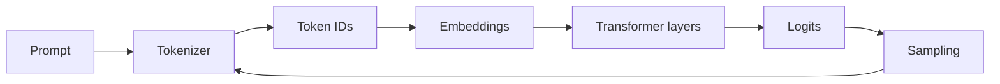

# Architecture and boundaries

A real model repeats the final steps one token at a time, often using a KV cache and optimized kernels. This repository's educational implementations omit those performance details.

The application boundary is `lab.providers.LLMProvider`. `OllamaProvider` speaks HTTP to Ollama, while `DemoProvider` makes tests and the five-minute path work offline. Agents, memory, and RAG depend on the interface rather than on Ollama directly.
